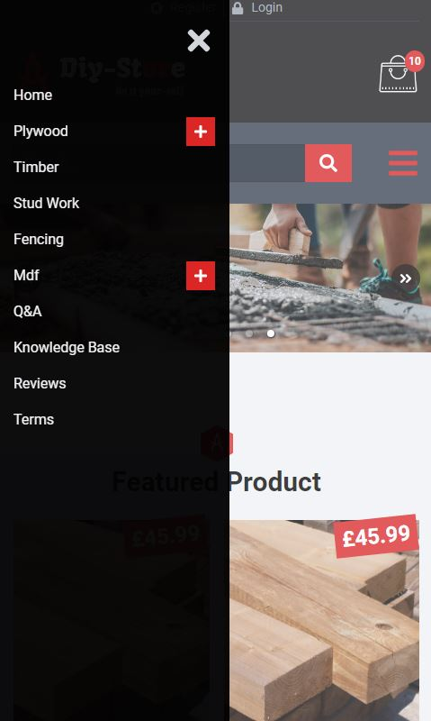
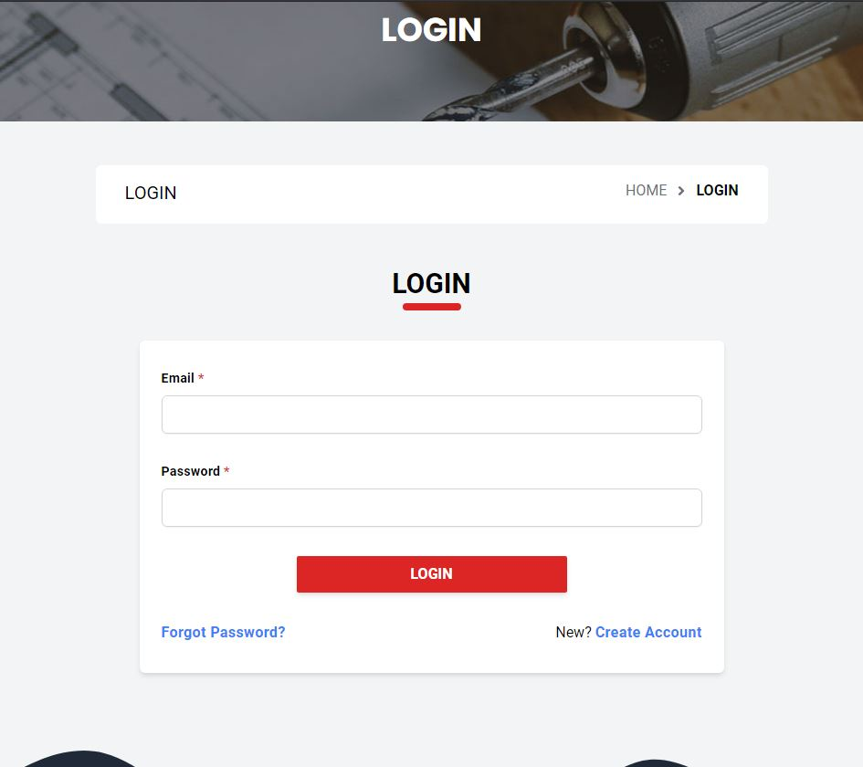
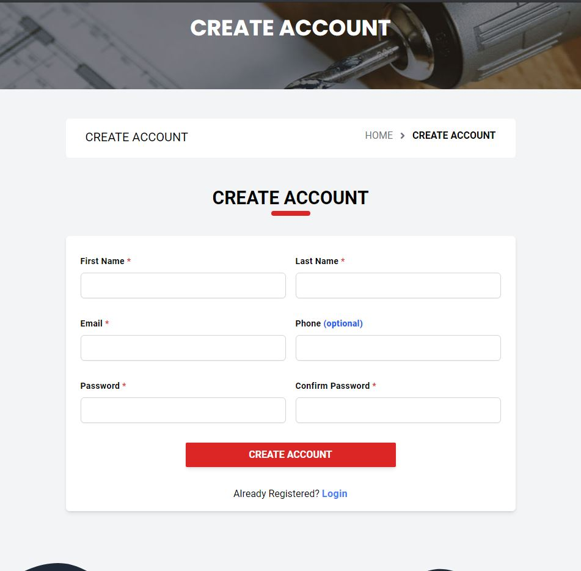

# React ecommerce template

React ecommerce template using tailwind css and react hooks  .

react 17.0.1, react-dom 17.0.1, react-icons 4.2.0, react-multi-carousel 2.6.2, react-responsive-carousel 3.2.14, react-router-dom 5.2.0, tailwindcss 2.0.3.

### Pages
 - Landing 
 - Login 
 - Register 
 - Question & Answer
 - Terms & Conditions
 - Delivery Information
 - Payment Methods
 - Knowledge Base
 - Site Review
 - Policies
    
### Todo:
 - Landing page Best Seller & Top Selling sliders components.
 - Landing pages Knowledge Base slider component.  
 - Forgot password
 - Reset password
 - Verify password
 - Cart summary
 - Checkout
 
### How to use

1. Clone the project

```sh
$ git clone https://github.com/rjiosum/React-Ecommerce.git
```

2. Install the dependencies:

```sh
$ yarn OR npm install
```

3. Run the project

```sh
$ npm run dev OR npm run build
```


 ### DEMO
  

<details>
  <summary>Other pages</summary>

### Mobile Nav


### Login page


### Register page


</details>
